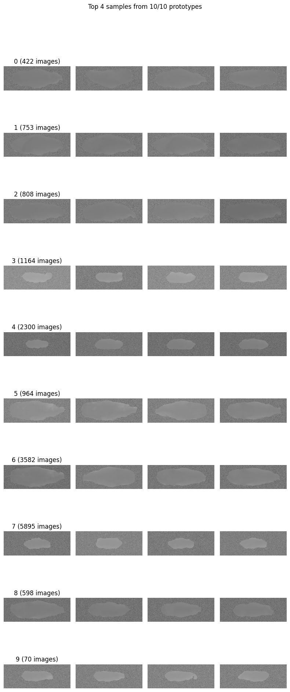
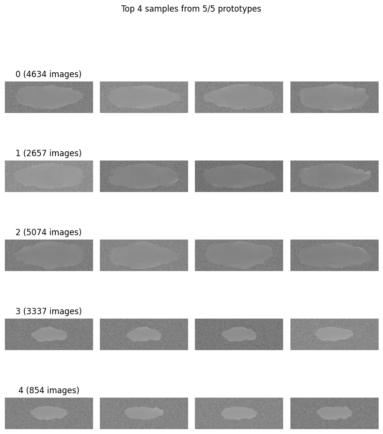

# SWAV Project

This repository contains the implementation and resources for the **SWAV** (Swapping Assignments between Views) project.

<!-- 
## Folder Structure

```
/u00/livia.meinhardt/projects/swav/
├── data/               # Dataset files
├── models/             # Pre-trained and custom models
├── scripts/            # Training and evaluation scripts
├── utils/              # Utility functions and helpers
├── experiments/        # Experiment configurations and results
└── README.md           # Project documentation
``` -->


## How execute this project

To run the SWAV project, you can use the following command:

```bash
python main.py modelv2_test.yaml
```

But first, you need process the dataset. You can do this by running the two notebooks provided in the `data_processing` folder:

1. `standarzing_img_size.ipynb`: This notebook will standardize the image sizes in your dataset.
2. `data_processing.ipynb`: This one will clip the values of the images between the 1st and 99th percentiles, normalize the images, and add white noise to the background.

After processing the dataset, you can set your yaml file with the hyperparameters you want to use for training. The `configs/modelv2_test.yaml` file contains an example of a hyperparameter configuration. Now you can run the command above to start training your model.

## Requirements
To run the SWAV project, you need to install the following Python packages:

```bash
pip install -r requirements.txt
```


## Tips about the hyperparameters

- **n_prototypes**: This parameter defines the number of prototypes used in the model. In the test, lower values (e.g., 10) lead to better results.

- **n_features_swav**: Is the latent space size of the model. Lower values (e.g., 32) can regularize the model and protect it from overfitting, especially when the dataset is small.


## Some results

In the image below, you can see how the model is grouping the images in the cluster space. The model is grouping by the size of the animals, which is a good indicator that the model is learning something useful. 

### 10 prototypes and 128 features


### 5 prototypes and 32 features



